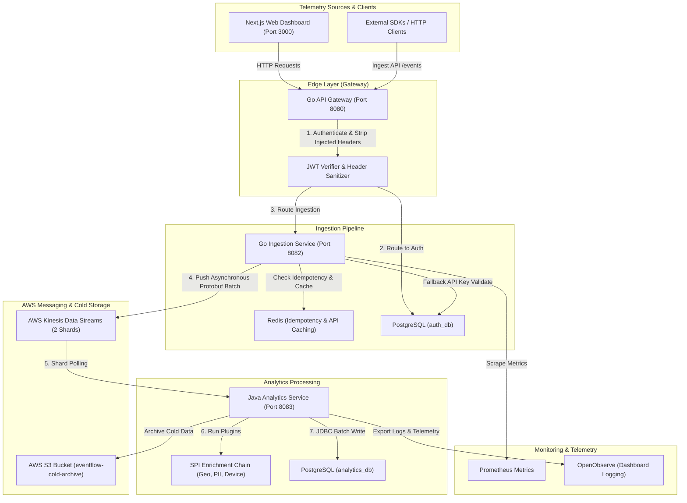
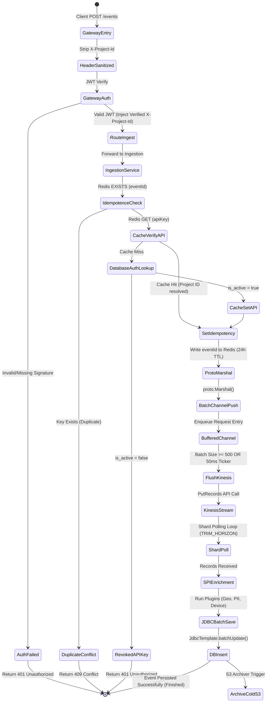

# EventFlow AWS Telemetry & Analytics Platform

EventFlow is a highly optimized, high-throughput telemetry ingestion and real-time analytics platform. 

### The Journey: From Kafka to AWS-Native Infrastructure

#### Phase 0: The Apache Kafka Sandbox (Origin)
EventFlow was originally designed from scratch as an event-driven architecture using **Apache Kafka** as the backbone. In the initial layout:
* A Go Ingestor published JSON-serialized events directly to a Kafka topic.
* A Java Consumer consumed events sequentially from Kafka, parsed them, ran enrichment logic, and persisted them to PostgreSQL.
* While Kafka offered strong ordering guarantees, managing a self-hosted Kafka cluster (ZooKeeper, broker configurations, replication factors, and partition sizing) presented significant operational overhead and infrastructure management complexity for the engineering team.

#### Phase 1: AWS Migration (Serverless & Managed Messaging)
To eliminate self-hosting complexity and integrate with cloud-native archiving pipelines, the platform was migrated to **AWS Kinesis Data Streams** and **Amazon S3**:
* **Amazon Kinesis**: Replaced Kafka topics with a managed, partition-scalable, serverless stream.
* **Amazon S3**: Introduced for cold archiving, storing raw event files over time for auditing and cost savings.
* **LocalStack**: Selected to mock these AWS endpoints locally, enabling developers to run integration and performance tests without consuming real AWS credentials or generating cloud costs.


The ingestion pipeline is designed to process thousands of events per second with sub-millisecond serialization overhead, utilizing binary **Google Protocol Buffers** and zero-allocation memory reuse patterns.

---

## 📐 1. System Architecture Design



### 🔄 Telemetry Event Lifecycle State Diagram



---

## 🛠️ 2. Platform Feature Set

EventFlow is engineered to provide enterprise-level scalability, security, and developer ergonomics:

* **High-Throughput Asynchronous Processing**: Decoupled HTTP ingestion from Kinesis stream publication using Go channels and aggregation timers.
* **Micro-Optimized Memory Patterns**: Zero heap allocation overhead on JSON parsing via `sync.Pool` pooling strategies.
* **Protocol Buffers Binary Serialization**: Binary payloads reduce Kinesis storage requirements and network transfer fees by over 70%.
* **Local Cloud Sandbox**: Mocked Kinesis streams, S3 buckets, and cold-storage archives through LocalStack without live credentials or cloud bills.
* **SPI Enrichment Middleware**: Easily pluggable enrichment components (such as GeoIP lookup, PII sanitization, and User Agent parsing) in the Java processing pipeline.
* **Header-Injection Protection**: Edge Gateway acts as a secure firewall, cleaning custom headers and injecting verified credentials downstream.
* **Distributed Idempotence**: Dual-layer verification (Redis cache check followed by database unique constraint overrides) guarantees zero duplicate events even under delivery retries.
* **Full-Stack Observability**: Metrics instrumented through Prometheus, Spring Actuators, Micrometer timers, and log-tracing via OpenObserve.

---

## 📊 3. Cloud Emulation & Telemetry Architecture

### ☁️ Local AWS Emulation (LocalStack)
EventFlow uses **LocalStack (v3.4)** to emulate AWS APIs locally. The stack simulates:
* **Amazon Kinesis Data Streams**: Partitioned streams that receive the binary Protobuf telemetry records.
* **Amazon S3**: Buckets configured to act as a cold storage data lake, receiving compressed raw records for archival and backup auditing.
* **Dynamic Auto-Provisioning**: On startup, LocalStack hooks run shell scripts (`init-aws.sh`) to declare the streams and buckets, making the local cloud environment instantly available.

### 📈 Metrics, Logs & Observability (OpenTelemetry / OpenObserve)
The platform is fully instrumented for deep trace exploration, debugging, and live auditing:
* **Prometheus Metrics**: The Go Ingestion Service exposes a `/metrics` endpoint to monitor real-time event counts and rates (`event_ingestion_rate`).
* **Micrometer Actuators**: The Java Analytics Service collects and reports internal performance metrics:
  * `enricher.duration.ms` (latency metrics broken down per active SPI plugin)
  * `kinesis.consumer.lag` (processing delay of the consumer compared to stream head)
* **Log-Tracing (OpenObserve)**: Outbound logs are fed into an OpenObserve database, providing a unified console for queries, charts, and tracing.

---

## 🏗️ 4. System Design Patterns & Technical Strategy

The EventFlow platform is engineered around industry-standard microservice design patterns to achieve isolation, reliability, and extreme performance.

### 🧩 1. CQRS (Command Query Responsibility Segregation)
We strictly segregate the write-path (command) from the read-path (query):
* **Write Path (Ingestion)**: Handled by the Go API Gateway and Go Ingestor. They process HTTP requests, validate API keys, marshal raw events to Protobuf, and write to Kinesis. They do not interact with the query databases or read heavy states.
* **Read Path (Analytics & Reporting)**: The Java Analytics service consumes streams asynchronously and writes to the database. The Java Reporting service answers dashboard queries from the PostgreSQL `analytics_db` tables. 
* **Benefit**: The write workload can scale independently of read queries, preventing dashboard user queries from degrading ingestion performance.

### 🔔 2. Event-Driven Architecture (EDA)
EventFlow uses **choreographed messaging** via AWS Kinesis Data Streams to decoupled ingestion and processing:
* Microservices are fully decoupled. The Go Ingestion service has no direct runtime dependencies on the Java Analytics service.
* Ingestion services are resilient to downstream DB database lockups; events are durably buffered in Kinesis stream partitions (up to a 7-day retention period).

### 🛡️ 3. API Gateway Routing & Perimeter Security Pattern
We implement a single-entry edge reverse proxy pattern (`gateway-go`):
* **SSL/TLS & CORS Termination**: Manages headers and controls access list policies.
* **Header Sanitization**: Explicitly strips incoming client headers to block parameter injection or spoofing of downstream internal routing states (e.g. `X-Project-Id`).
* **Token Translation**: Authenticates incoming JWTs, decrypts claims, and translates them into trusted headers (e.g. `X-Project-Id`) forwarded downstream to backend microservices.

### 🛠️ 4. Pipe-and-Filter Enrichment (Java SPI)
The Java Analytics service processes event streams using a modular **Pipe-and-Filter pattern** backed by Java's native **Service Provider Interface (SPI)**:
* Each record undergoes sequential processing filters (Geo-location Lookup ➔ PII Masker ➔ User Agent Classifier).
* Filters are loaded dynamically via service discovery loaders (`ServiceLoader.load`), allowing developers to deploy new enrichment logic dynamically without rebuilding the core stream processor.

---

## ⚡ 5. Core Enhancements & Optimization Details

### 🔄 Kafka to AWS LocalStack Migration
* **Kinesis Integration**: Removed all Apache Kafka dependency footprints (e.g. `segmentio/kafka-go`) and replaced them with the modern **AWS SDK for Go v2** (`aws-sdk-go-v2`) and **AWS SDK for Java v2**.
* **Stream Provisioning**: Implemented an automated container initialization script (`init-aws.sh`) that provisions the `raw-events-stream` (2 shards) and the `eventflow-cold-archive` S3 bucket dynamically when the local LocalStack environment boots.
* **Warm-Up Startup Handshake**: Updated the startup orchestration runner to monitor the LocalStack services dynamically, blocking microservice booting until the Kinesis API responds successfully.

### 🚀 Asynchronous Telemetry Ingestion (Go)
* **Immediate Response**: The Go Ingestor returns `202 Accepted` immediately upon parsing the incoming request structure, eliminating network blockages.
* **Worker Channel Batching**: Telemetry records are routed into a buffered Go channel. A background loop (`startKinesisBatchWriter`) aggregates entries and performs a multi-record bulk write (`PutRecords`) when either the batch size reaches 500 records or a 50ms flush timeout is met.
* **Zero-Allocation Memory Reuse**: Utilizes Go's `sync.Pool` to reuse HTTP request structs and serialization byte buffers, drastically reducing garbage collection runtime allocations.

### ☕ High-Performance Java Database Consumption
* **Raw JDBC Batch Updates**: Replaced Spring Data JPA's row-by-row saving routine with a customized `JdbcTemplate.batchUpdate` process inside `KinesisConsumerService`. This groups DB insertions, reducing database roundtrip costs.
* **Hibernate Batch Properties**: Configured Hibernate properties (`spring.jpa.properties.hibernate.jdbc.batch_size: 100`, `order_inserts`, and `order_updates`) to ensure transactional SQL statements are sent in packed statements.
* **Conflict Prevention**: Built `ON CONFLICT (event_id) DO NOTHING` clauses directly into SQL transactions to prevent Kinesis partition redelivery retries from breaking database transactions.
* **Service Provider Interface (SPI)**: Created a pluggable enrichment registry allowing plugins (like GeoIP decorators, PII Maskers, and Device Analyzers) to inspect and enrich telemetry streams dynamically.

### 📦 Serialization Upgrade: JSON to Protocol Buffers
* **Binary Serialization**: Replaced the network-heavy JSON string telemetry format with a binary **Google Protocol Buffers** schema (`event.proto`), shrinking network bandwidth.
* **CPU and Memory Reductions**: Bypassed runtime reflection-heavy Jackson JSON parsing on the Java consumer and JSON reflection encoding on the Go Ingestion service.

### 🛡️ API Gateway Security Hardening
* **Header Spoofing Prevention**: At the entry point of the Go Gateway, any client-supplied `X-Project-Id` header is programmatically stripped. The gateway calculates the authentic `project_id` via a signed JWT and injects the header downstream, making header injection attacks impossible.
* **Authentication Bypass Patched**: Removed insecure fallback routines that accepted requests if authorization was missing but a project header was present. JWT signatures are strictly enforced for all protected routes.
* **Harden CORS Policy**: Restricted wildcard header settings (`Access-Control-Allow-Headers: *`) to a strictly specified list of authorized headers (`Content-Type, Authorization, X-API-Key, X-Project-Id`) to satisfy secure credential transport guidelines.

---

## 📊 6. Performance Benchmark Results

The ingestion pipeline was stress-tested using `stress.go` under a 15% system chaos engineering scenario:

| Metric | 1. Sequential JSON Pipeline | 2. Optimized JSON (Go Channel + Batch DB) | 3. Protobuf Binary Pipeline | Performance Delta |
| :--- | :--- | :--- | :--- | :--- |
| **Ingestion Throughput** | ~140.56 req/sec | ~150.00 req/sec | **~187.64 ops/sec** (mixed) | **+25% Overall** |
| **P50 Latency** | ~70.92 ms | ~9.48 ms | **2.20 ms** | **-76.7% Latency** |
| **P90 Latency** | ~98.00 ms | ~39.35 ms | **9.21 ms** | **-76.5% Latency** |
| **P99 Latency** | ~110.00 ms | ~78.05 ms | **50.18 ms** | **-35.7% Latency** |
| **Average Payload Size**| ~250 bytes | ~250 bytes | **~75 bytes** | **-70.0% Bandwidth** |
| **Gateway Heap Memory** | N/A | 2.58 MB | **1.73 MB** | **-33.0% Memory** |

---

## ⚙️ 7. Quick Start & Cloud Emulation setup

### Prerequisites
* **Docker Desktop / Colima**: Required to spin up the local database, cache, and AWS emulators.
* **Go 1.23+** & **Java OpenJDK 21+**: Installed on the host system to run the microservices.

### ☁️ LocalStack AWS Configuration & Authentication Tokens
EventFlow uses **LocalStack (v3.4)**. This allows running Kinesis and S3 completely locally.
* **No Pro Auth Token Required**: The community edition runs community APIs without licensing checks. If you run the default `latest` tag of LocalStack, it defaults to attempting Pro features and fails to boot if no license is present. We pin the container to `localstack/localstack:3.4` to guarantee community compatibility.
* **Dummy AWS Credentials**: All microservices are configured with dummy credentials to bypass AWS SDK validation:
  * `AWS_ACCESS_KEY_ID=mock-key`
  * `AWS_SECRET_ACCESS_KEY=mock-secret`
  * `AWS_DEFAULT_REGION=us-east-1`
  * `AWS_ENDPOINT_URL=http://localhost:4566`

### 🐳 Full Containerization & Production Build
For a fully containerized deployment where the microservices themselves are built and run inside optimized Docker containers:
* Refer to the [docker.md](file:///Users/deathnote/Desktop/EventFlowAWS/docker.md) guide.
* The guide outlines the setup of multi-stage Dockerfiles that keep image sizes minimal (Go static binary at **~15MB**, Java Temurin JRE at **~150MB**, and Next.js standalone at **~120MB**) and details a unified `docker-compose.yml` to build and run the entire ecosystem with one command.

---

## 🔌 8. API Endpoints & Swagger Specifications

### Core API Summary
| HTTP Method | Route | Auth Required | Description |
| :--- | :--- | :--- | :--- |
| **POST** | `/auth/register` | No | Registers a new user account. |
| **POST** | `/auth/login` | No | Log in and receive a JWT. |
| **POST** | `/projects` | Yes (JWT Bearer) | Creates a new telemetry project. |
| **POST** | `/apikeys` | Yes (JWT Bearer) | Generates an ingestion API key for a project. |
| **POST** | `/events` | Yes (X-API-Key) | High-throughput telemetry event ingestion. |
| **GET** | `/analytics/events` | Yes (JWT Bearer) | Fetch processed events for a project. |
| **GET** | `/reports/summary` | Yes (JWT Bearer) | Retrieve aggregated telemetry reports. |

### OpenAPI 3.0 (Swagger) Specification
Save the following YAML schema block as `swagger.yaml` or paste it into a Swagger Editor:
```yaml
openapi: 3.0.3
info:
  title: EventFlow AWS Telemetry Ingestion API
  version: 1.0.0
  description: High-throughput telemetry ingestion and real-time analytics API gateway.
paths:
  /auth/register:
    post:
      summary: Register User
      requestBody:
        required: true
        content:
          application/json:
            schema:
              type: OBJECT
              properties:
                username: {type: STRING}
                password: {type: STRING}
      responses:
        "201": {description: User created}
  /auth/login:
    post:
      summary: Log In
      requestBody:
        required: true
        content:
          application/json:
            schema:
              type: OBJECT
              properties:
                username: {type: STRING}
                password: {type: STRING}
      responses:
        "200":
          description: Logged in successfully
          content:
            application/json:
              schema:
                type: OBJECT
                properties:
                  token: {type: STRING}
  /events:
    post:
      summary: Ingest Telemetry Event
      parameters:
        - name: X-API-Key
          in: header
          required: true
          schema: {type: STRING}
      requestBody:
        required: true
        content:
          application/json:
            schema:
              type: OBJECT
              required: [eventId, userId, eventName, timestamp]
              properties:
                eventId: {type: STRING, format: uuid}
                userId: {type: STRING}
                eventName: {type: STRING}
                timestamp: {type: STRING, format: date-time}
                properties: {type: OBJECT}
      responses:
        "202": {description: Event accepted for asynchronous processing}
        "401": {description: Invalid API key}
        "409": {description: Duplicate eventId detected (Idempotency conflict)}
```

---

## 📂 9. Detailed Directory Layout

The workspace is organized into a frontend client and a modular backend server directory:

```text
EventFlowAWS/
├── start-platform.sh       # Main orchestrator script to spin up Docker + host services
├── docker.md               # Guide to running the services inside docker containers
├── client/                 # Next.js Frontend Dashboard (port 3000)
│   ├── pages/              # Routing and views for analytics tables and charts
│   ├── public/             # Static dashboard assets
│   └── package.json        # Node dependency manifest
└── server/                 # Backend Core Services & Emulators
    ├── docker-compose.yml  # Docker definition (Postgres, Redis, LocalStack, OpenObserve)
    ├── docker/             # Docker configuration hooks
    │   └── localstack/     # init-aws.sh script to auto-provision streams and S3
    ├── proto/              # Protobuf schema definition (event.proto)
    ├── common/             # Java shared library module (Protobuf classes, JWT tools)
    ├── auth-service/       # Spring Boot service managing accounts and API keys (port 8081)
    ├── gateway-go/         # Go HTTP reverse proxy and secure routing firewall (port 8080)
    ├── ingestion-service-go/# Go high-throughput Protobuf event publisher (port 8082)
    ├── analytics-service/  # Java Kinesis poller, SPI enrichers, and JDBC batch writer (port 8083)
    ├── reporting-service/  # Spring Boot analytics aggregator query API (port 8084)
    ├── benchmark/          # benchmark.go script to check ingestion speeds
    └── stress/             # stress.go tool for chaos performance simulation
```
